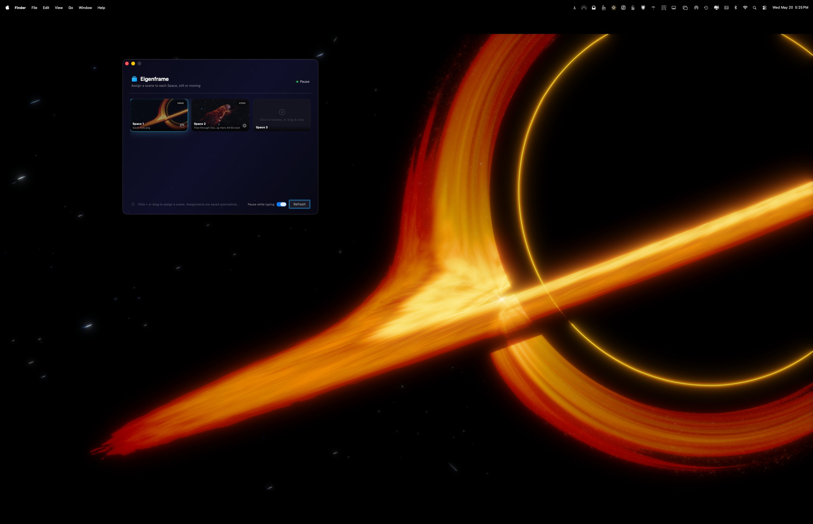
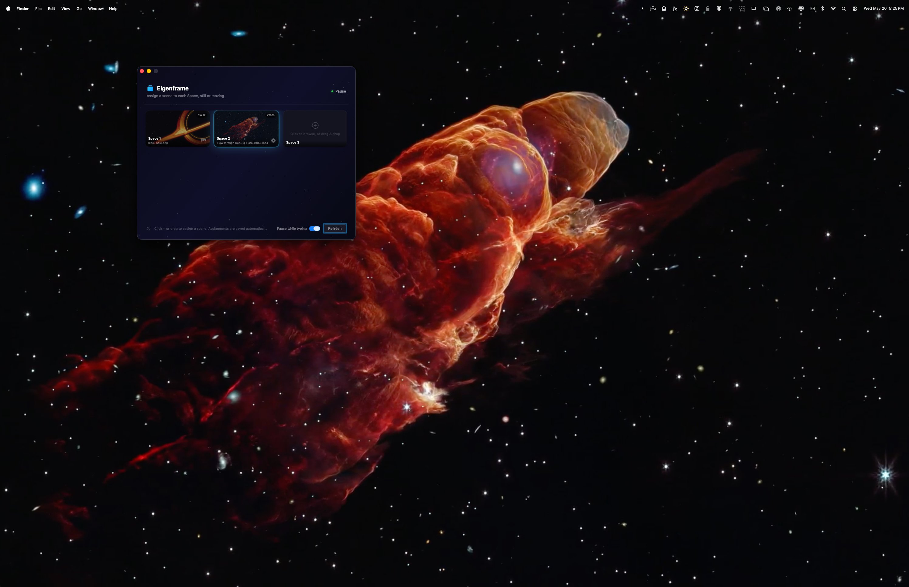

# Eigenframe

In 1957, physicist Hugh Everett proposed that reality branches constantly into parallel coexisting universes, each one its own distinct and independent world. Eigenframe takes its name from that idea and applies it to your desktop. Each Space gets its own scene, still or moving, running quietly behind your work.

Assign any image or video to each of your Mission Control Spaces. Changes take effect instantly. Everything loops seamlessly and runs quietly in the menu bar.

  





https://github.com/user-attachments/assets/9efd065b-4f84-4e87-8976-bcfc51f52826

## Requirements

- macOS 13 (Ventura) or later
- Apple Silicon (M1 or later)

## Install

Download the latest `Eigenframe.dmg` from the [Releases page](https://github.com/drabhikroy/Eigenframe/releases), open it, and drag Eigenframe to your Applications folder. Right-click and choose Open on first launch to bypass the Gatekeeper warning.

## Build from Source

To build from source you will also need Xcode Command Line Tools (`xcode-select --install`) and Homebrew (`brew install create-dmg`).

### Step 1: Create a signing certificate (required once)

macOS requires a stable code signing identity for Input Monitoring permission to persist across builds. Without this, the "Pause while typing" feature cannot request permission.

1. Open **Keychain Access**
2. From the menu bar: **Keychain Access → Certificate Assistant → Create a Certificate...**
3. Set Name to `Eigenframe Dev`, Identity Type to `Self Signed Root`, Certificate Type to `Code Signing`
4. Click Create, then Done
5. Find the certificate in Keychain Access, double-click it, expand Trust, and set **When using this certificate** to **Always Trust**

Verify it worked:
```bash
security find-identity -v -p codesigning
# Should show: "Eigenframe Dev"
```

### Step 2: Build

```bash
git clone https://github.com/drabhikroy/Eigenframe
cd Eigenframe
chmod +x Installer/build_and_package.sh
./Installer/build_and_package.sh
```

The script builds the app, signs it with your `Eigenframe Dev` certificate, copies it to `/Applications`, and produces `Installer/Eigenframe.dmg`.

### Step 3: First launch

Because Eigenframe is not from the Mac App Store, right-click `/Applications/Eigenframe.app` and choose **Open** the first time. After that it launches normally.

### Manual build (command line only, no DMG)

```bash
swift build --configuration release
```

## First Launch

1. The app lives in your menu bar as `[λ]`
2. Click the icon and the control panel opens automatically
3. You will see a card for each of your Mission Control Spaces
4. Drag any image or video onto a Space card, or click the `+` icon to browse
5. Switch Spaces and your scene plays on each one

## Permissions

**Input Monitoring** — required for the optional "Pause while typing" feature. When you first enable the toggle, macOS will prompt you to grant permission in System Settings → Privacy & Security → Input Monitoring. If no prompt appears, add Eigenframe manually. This permission persists across rebuilds as long as you use the same `Eigenframe Dev` signing certificate.

No other permissions are required. Space detection uses `CGSGetActiveSpace`, a private but stable system API, which does not require Accessibility permission.

## Supported Formats

Static images: JPEG, PNG, HEIC, GIF, WebP, TIFF, BMP

Video: MP4, MOV, M4V, MKV, AVI, WebM, HEVC, 3GP

All videos are muted. For best performance, use short clips at 1080p encoded in H.264 or HEVC.

## Performance

Short clips at 1080p or lower give the smoothest experience. Very large files, high resolutions, or multiple simultaneous videos may increase GPU and CPU usage. If you notice performance issues, re-encode your video with HandBrake or ffmpeg before assigning it. See the Help file for specific commands.

Use the **Pause** button in the control panel or menu bar to stop all video playback without quitting, useful during intensive tasks or to save battery.

## How It Works

- `CGSGetActiveSpace()` — a stable private macOS API in use since Mojave — identifies the active Space
- A 60fps poll timer detects Space changes with minimal latency alongside `NSWorkspace.activeSpaceDidChangeNotification`
- `AVPlayerLayer` inside a borderless `NSWindow` at desktop window level renders video behind desktop icons
- `AVPlayerLooper` handles seamless gapless looping
- `NSImageView` handles static image wallpapers
- `CGEventTap` in listen-only mode detects keyboard activity for the pause-while-typing feature

## Known Limitations

- **Space switch animation**: The Switch button was removed. Programmatic Space switching via `CGSManagedDisplaySetCurrentSpace` changes internal state correctly but does not trigger macOS's visual transition animation. Use `Control+Number` keyboard shortcuts for animated Space switching.
- **Wallpaper transition delay**: There is a brief delay when switching Spaces while a wallpaper loads. This is a macOS compositor constraint and is partially mitigated by pre-buffering video on startup.

## Help and FAQ

Open `Help/Eigenframe_Help.html` in any browser, or launch the app and choose **Help and FAQ** from the menu bar icon.

## Screenshot Credits

The wallpapers shown in the screenshots are NASA/ESA public domain imagery.

- **Black Hole Accretion Disk Visualization** — NASA's Goddard Space Flight Center / Jeremy Schnittman. [Source](https://svs.gsfc.nasa.gov/14146/)
- **Flow through Cosmic Tornado — Herbig-Haro 49/50** — ESA/Webb, NASA, CSA, STScI. [Source](https://www.esa.int/ESA_Multimedia/Videos/2025/03/Flow_through_Cosmic_Tornado_Herbig-Haro_49_50)

Both files are included in `docs/examples/` with a full credits file. See [docs/examples/CREDITS.md](docs/examples/CREDITS.md).

## Disclaimer

The software is provided as-is, without warranty of any kind, express or implied. By using Eigenframe you accept all risks associated with its use. The authors accept no responsibility for data loss, system instability, unexpected behavior following a macOS update, or any other issues arising from its use.

Eigenframe uses private undocumented macOS APIs (`CGSGetActiveSpace` and `CGSCopyManagedDisplaySpaces`) for Space detection. These APIs have been stable since macOS Mojave in 2018, but Apple may change or remove them in a future release without notice. If that happens, Space detection will stop working until an update is released.

This is an independent open source project with no affiliation with Apple Inc. macOS, Mission Control, and Spaces are trademarks of Apple Inc.

## License

Copyright (c) 2026 Abhik Roy

Released under the MIT License. See [LICENSE](LICENSE) for the full text.
